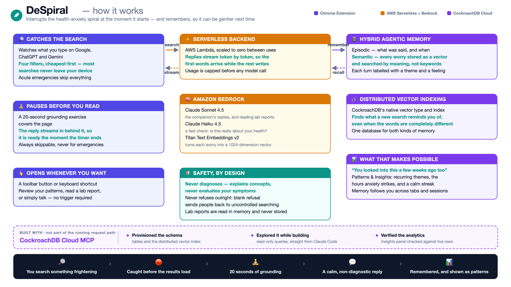

<div align="center">


# DeSpiral

**Interrupts the health-anxiety spiral at the moment it starts.**

A Chrome extension that catches anxiety-driven medical searches as you type them,
pauses you for twenty seconds of grounding, and answers with a calm,
**non-diagnostic** companion that remembers what you've worried about before.

**[▶ Watch the 3-minute demo](https://youtu.be/qroc2C4POkk)**

</div>

---

> ### 📌 For hackathon judges
>
> **You do not need to build anything from this repository.** A ready-to-install
> build of the extension, already wired to the live backend, is distributed via
> the link in **Additional Information** on the hackathon submission page. Use
> that — it works out of the box, with a seeded demo persona so memory recall and
> the Insights panel have real history to show from the first search.
>
> This repository is here to be _read_: it is the same source, with the backend
> endpoint replaced by a placeholder so a public repo does not expose a live
> unauthenticated URL. Loading `extension/` straight from here will intercept
> searches and open the panel, but cannot reach the backend until that
> placeholder is filled in.

---

## The problem

Someone notices a health symptom, searches it, and lands on the worst possible
explanation. That result feeds the next search, which is more frightening than
the last. This is a well-documented loop, and the moment it takes hold is the
moment a search box accepts a query.

DeSpiral intervenes exactly there — not with a blocker, and not with a diagnosis.

## What it does

**Intercepts** health searches on Google, ChatGPT and Gemini, through four tiers:
an exact keyword filter, a typo-tolerant fuzzy matcher, a weak-signal gate, and
finally a small cloud model for anything ambiguous.

**Pauses** for a 20-second grounding exercise — extended exhale, somatic tension
release, or 3-2-1 sensory grounding, chosen at random. While you breathe, the
answer is already being generated behind the overlay, so it's waiting when the
timer ends. Skippable at any time, and **acute emergencies bypass it entirely**.

**Remembers** across sessions. Every turn is embedded and stored in CockroachDB;
the next conversation retrieves semantically related past worries by vector
similarity, so the companion can say _"you looked this up three weeks ago too"_ —
gently, never as a scold.

**Reflects** it back in a Patterns & Insights panel: recurring worry themes,
what time of day anxiety tends to hit, emotional trend over time, and a calm
streak. The observations are shown; the conclusions are yours to draw.

**Opens on demand**, too — click the toolbar icon or press **⌥⇧D**
(**Alt+Shift+D** on Windows/Linux) on any page to review your patterns, read a
lab report, or just talk to it, without having to search for something
frightening first. Opened this way it sends no page context at all.

> Chrome forbids extensions from running on `chrome://` pages, so the icon
> cannot open the panel on the New Tab Page. Try it on an ordinary page.

---

## Architecture

<div align="center">



<sub>Also available as <a href="docs/DeSpiral_Architecture.svg">SVG</a>.</sub>

</div>

```
Google / ChatGPT / Gemini
        │  DOM interception (content.js)
        │  Tier 1 exact → Tier 1b fuzzy → weak-signal gate → cloud intent check
        ▼
Chrome Extension (MV3, Shadow DOM)
        │  streaming fetch from the service worker (CORS-exempt)
        ▼
AWS Lambda Function URL  ──LWA──▶  uvicorn / FastAPI
        │
        ├─▶ Amazon Bedrock   Claude Sonnet 4.5 (streamed reply + turn classification)
        │                    Claude Haiku 4.5 (yes/no intent check)
        │                    Titan Embed v2   (1024-dim embeddings)
        │
        └─▶ CockroachDB Cloud
                user_profiles          identity + preferences
                patient_episodes       episodic memory (what was said)
                semantic_context_memory  VECTOR(1024) + C-SPANN vector index
```

**Hybrid memory** is the core idea: episodic rows give chronology, the vector
index gives _"what does this remind me of"_, and both are assembled into the
prompt each turn. The live conversation rides in native `messages[]`; long-term
memory is re-queried per turn and injected into the system prompt.

### Stack

|              |                                                                             |
| ------------ | --------------------------------------------------------------------------- |
| **Frontend** | Chrome MV3, vanilla JS, all UI inside a Shadow DOM                          |
| **Backend**  | Python 3.12, FastAPI behind the AWS Lambda Web Adapter                      |
| **Database** | CockroachDB Cloud — native `VECTOR` type + distributed C-SPANN vector index |
| **Models**   | Amazon Bedrock — Claude Sonnet 4.5, Claude Haiku 4.5, Titan Embed v2        |

---

## Install

The extension is unpacked — no store listing.

1. Clone this repo.
2. Open `chrome://extensions` and turn on **Developer mode**.
3. Click **Load unpacked** and select the **`extension/`** folder.
4. Search for something medical on Google — `high blood pressure`, `lipid profile
test not normal`, `weird mole on my back`.

> **Backend endpoint — required before step 3 will do anything.** The public
> repository ships a **placeholder** in place of the live Lambda URL, so that a
> public repo never carries an unauthenticated endpoint. Replace it in **two**
> places, or the extension will load but every request will fail:
>
> | file                      | what to replace                          |
> | ------------------------- | ---------------------------------------- |
> | `extension/background.js` | the `LAMBDA_ENDPOINT` constant           |
> | `extension/manifest.json` | the matching entry in `host_permissions` |
>
> Missing the manifest entry is the easy mistake: Chrome then **blocks** the
> request even though the code is correct. Judges can skip all of this — the
> distributed build already has the real endpoint (see the note at the top).

### You start on the demo persona

With no configuration, DeSpiral uses a **seeded demo identity** carrying three
months of history — so the memory recall and the Insights panel have something
real to show immediately. The header displays a **Demo persona** chip whenever
this is active.

To start from a blank slate, run this in the extension's service-worker console
(`chrome://extensions` → _service worker_) and reload the page:

```js
chrome.storage.local.set({ user_token: crypto.randomUUID() });
```

To go back to the demo persona:

```js
chrome.storage.local.remove("user_token");
```

---

## Safety

This is the part that shaped most of the design.

- **Never diagnoses.** The model may explain general medical concepts the way a
  reputable clinic would, but never evaluates _your_ symptoms, and never
  confirms or rules anything out for you personally.
- **Doesn't refuse either.** Blank refusal erodes trust and sends people back to
  uncontrolled searching — which is the behaviour this exists to interrupt. The
  companion acknowledges, safety-checks, then offers.
- **Emergencies bypass the pause.** Queries signalling an acute presentation —
  choking, can't breathe, chest pain radiating, anaphylaxis, heavy bleeding,
  overdose, self-harm — skip the grounding overlay entirely and go straight
  through. A skip button assumes a calm user reading the UI; someone searching
  `choking` is not that user.
- **Never weaponises memory.** Recall is used to reassure, never to count or
  shame someone's searches back at them.
- **Text with no health signal stays on your device.** On ChatGPT and Gemini —
  where the intercepted text is your full prompt, not a search query — anything
  without a health signal is never sent anywhere.

DeSpiral is a support tool for health anxiety. It is not a medical device, not a
diagnosis, and not a substitute for a clinician.

---

## Repo layout

```
extension/
  manifest.json          MV3 — content-script load order is load-bearing
  content.js             DOM interception + tier routing
  background.js          service worker: identity, streaming Port, intent check
  components/
    drawer.js            the entire UI (Shadow DOM)
    interstitial.js      20-second grounding overlay
  utils/
    regex-filter.js      Tier 1 — exact roots and whole words
    fuzzy-match.js       Tier 1b — typo tolerance
    weak-signals.js      the gate deciding what may reach the cloud
    emergency-signals.js acute presentations that bypass the pause
    __tests__/           588 assertions, plain node, no framework
  report-panel.js        lab-report upload, mounts into the drawer's shadow root
backend/
  app.py                 FastAPI routes + the spend gate
  lambda_handler.py      shared helpers + a buffered handler (tests / rollback)
  reports.py             POST /report — reads memory, writes nothing
  insights.py            read-only aggregation for Patterns & Insights
  intent.py              Haiku yes/no medical-intent classifier
  prompts/               the system prompts, in full
  db/schema.sql          source-of-truth DDL
  package_lambda.py      builds the deployment zip
docs/
  DeSpiral_Architecture.png / .svg
```

Run the test suites with:

```bash
node extension/utils/__tests__/filters.test.js
node extension/utils/__tests__/interstitial.test.js
```

---

## The backend

Python 3.12 / FastAPI, running on **AWS Lambda behind the Lambda Web Adapter**.
That combination exists for one reason: **Lambda's native response streaming is
Node-only**, and the first token needs to arrive while the rest of the reply is
still being written. LWA runs a real `uvicorn` server inside the function, so
`StreamingResponse` works exactly as it would anywhere else.

| route            | what it does                                                          | metered |
| ---------------- | --------------------------------------------------------------------- | ------- |
| `POST /`         | the chat turn — embed, vector search, `converse_stream`, then persist | yes     |
| `POST /intent`   | Haiku yes/no: _is this about the writer's own health?_                | yes     |
| `POST /report`   | streams a plain-language reading of an uploaded lab report            | yes     |
| `POST /insights` | read-only aggregates for Patterns & Insights                          | no      |
| `GET /`          | readiness probe for the adapter                                       | no      |

Three details worth reading the code for:

- **Persistence happens _after_ the stream finishes**, in the generator's
  `finally`, so a mid-stream disconnect still saves the turn and the extra
  classification call never delays the first token.
- **`POST /report` writes nothing at all** — no row, no embedding, and no content
  logging even when debug logging is enabled. The privacy badge in the UI is
  only true because that route has deliberately _no_ persistence block, which is
  the first thing a reviewer should check.
- **Every route that costs money claims a quota unit before any model call**, in
  a single atomic `UPDATE … RETURNING`. It is one statement rather than a
  read-then-write because CockroachDB's serializable isolation turns the racy
  version into visible `40001` retries instead of silent double-spend.

The database is **CockroachDB Cloud**, using the native `VECTOR` type and a
distributed C-SPANN vector index — no `pgvector` extension, and one database for
both episodic and semantic memory. `backend/db/schema.sql` is the source of
truth and was originally provisioned through the **CockroachDB Cloud MCP
server**; the running product connects directly over SQL.

Deploying it needs AWS credentials and a CockroachDB cluster of your own, so it
is not a `clone and run` — the extension is the part built to be tried.

---

## Notes for reviewers

- **Spend is capped in the app itself.** The endpoint is public, so every route
  that costs money claims against an atomic daily + lifetime counter in
  CockroachDB before any model call. Chat and the intent check have separate
  budgets, so cheap high-volume calls can't starve the expensive path.
- **The false-positive corpora in the tests are deliberate.** Interception is
  full of near-misses — `ear` vs `early`, `node` vs `nodejs`, `cancer` vs
  `dancer`, `tingl` vs `testing`. Each was measured, not guessed, and the tests
  fail if a guard is removed.
- **There is no authentication.** `user_token` is an identifier, not a
  credential. That is acceptable for a time-boxed demo with seeded data and
  would not be for a real deployment.

Built for the CockroachDB × AWS hackathon.
